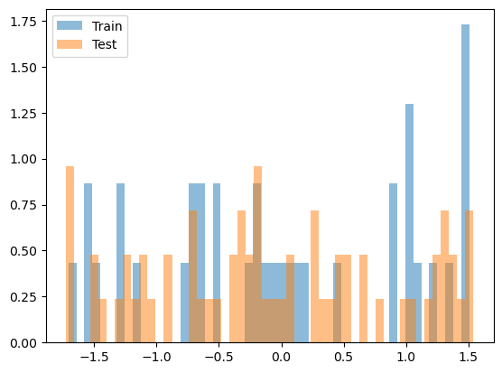

hybridpredictmaize22
================

<!-- WARNING: THIS FILE WAS AUTOGENERATED! DO NOT EDIT! -->

Repo for analysis of GEM prediction for maize yield

## Install

``` sh
pip install hybridpredictmaize22
```

## How to use

A demo of the library specifically for this dataset

Generate random data that is the same form as the actual dataset

``` python
import random
#generate random SNP matrix
gene_dosages = [0, .5, 1]
years = [2018,2019]
snp_length = 100
number_hybrids = 20


number_environments = 10
env_col = []
for i,y in zip(np.arange(number_environments),[random.choice(years) for _ in range(number_environments)]):
    env_col.append(f'{i}_{y}')

snp_matrix = (np.arange(number_hybrids),np.array([[random.choice(gene_dosages) for x in range(snp_length)] for _ in range(number_hybrids)]))

#generate random yield data
random_yields = [random.uniform(-1,1) for _ in range(100)]
random_hybrids = [random.choice(range(number_hybrids)) for _ in range(100)]
random_environments = [random.choice((env_col)) for _ in range(100)]
```

``` python
yield_data = pd.DataFrame({"Hybrid":random_hybrids, "Yield_Mg_ha":random_yields, 'Env':random_environments})
yield_data.head()
```

<div>
<style scoped>
    .dataframe tbody tr th:only-of-type {
        vertical-align: middle;
    }

    .dataframe tbody tr th {
        vertical-align: top;
    }

    .dataframe thead th {
        text-align: right;
    }
</style>
<table border="1" class="dataframe">
  <thead>
    <tr style="text-align: right;">
      <th></th>
      <th>Hybrid</th>
      <th>Yield_Mg_ha</th>
      <th>Env</th>
    </tr>
  </thead>
  <tbody>
    <tr>
      <th>0</th>
      <td>6</td>
      <td>0.653857</td>
      <td>3_2018</td>
    </tr>
    <tr>
      <th>1</th>
      <td>2</td>
      <td>0.148429</td>
      <td>0_2018</td>
    </tr>
    <tr>
      <th>2</th>
      <td>1</td>
      <td>0.199330</td>
      <td>3_2018</td>
    </tr>
    <tr>
      <th>3</th>
      <td>19</td>
      <td>-0.156858</td>
      <td>7_2019</td>
    </tr>
    <tr>
      <th>4</th>
      <td>14</td>
      <td>-0.397755</td>
      <td>7_2019</td>
    </tr>
  </tbody>
</table>
</div>

``` python
Weather_Table = np.random.random((50,number_environments))
weather_table = {}
for c,i in enumerate(Weather_Table):
    weather_table[c] = i
    
weather_data = pd.DataFrame(weather_table)
weather_data.insert(0,'Env',env_col)
weather_data.insert(1,'Year',[x.split('_')[1] for x in env_col])

weather_data
```

<div>
<style scoped>
    .dataframe tbody tr th:only-of-type {
        vertical-align: middle;
    }

    .dataframe tbody tr th {
        vertical-align: top;
    }

    .dataframe thead th {
        text-align: right;
    }
</style>
<table border="1" class="dataframe">
  <thead>
    <tr style="text-align: right;">
      <th></th>
      <th>Env</th>
      <th>Year</th>
      <th>0</th>
      <th>1</th>
      <th>2</th>
      <th>3</th>
      <th>4</th>
      <th>5</th>
      <th>6</th>
      <th>7</th>
      <th>...</th>
      <th>40</th>
      <th>41</th>
      <th>42</th>
      <th>43</th>
      <th>44</th>
      <th>45</th>
      <th>46</th>
      <th>47</th>
      <th>48</th>
      <th>49</th>
    </tr>
  </thead>
  <tbody>
    <tr>
      <th>0</th>
      <td>0_2018</td>
      <td>2018</td>
      <td>0.223975</td>
      <td>0.513367</td>
      <td>0.297753</td>
      <td>0.762677</td>
      <td>0.812710</td>
      <td>0.954872</td>
      <td>0.726236</td>
      <td>0.456598</td>
      <td>...</td>
      <td>0.517883</td>
      <td>0.960513</td>
      <td>0.579636</td>
      <td>0.012792</td>
      <td>0.227954</td>
      <td>0.613942</td>
      <td>0.339010</td>
      <td>0.625351</td>
      <td>0.808647</td>
      <td>0.876516</td>
    </tr>
    <tr>
      <th>1</th>
      <td>1_2018</td>
      <td>2018</td>
      <td>0.201656</td>
      <td>0.360718</td>
      <td>0.286876</td>
      <td>0.725822</td>
      <td>0.736415</td>
      <td>0.977615</td>
      <td>0.442322</td>
      <td>0.134740</td>
      <td>...</td>
      <td>0.805358</td>
      <td>0.863313</td>
      <td>0.108791</td>
      <td>0.508733</td>
      <td>0.014159</td>
      <td>0.719310</td>
      <td>0.008152</td>
      <td>0.114369</td>
      <td>0.580721</td>
      <td>0.578248</td>
    </tr>
    <tr>
      <th>2</th>
      <td>2_2018</td>
      <td>2018</td>
      <td>0.015734</td>
      <td>0.921809</td>
      <td>0.806261</td>
      <td>0.569624</td>
      <td>0.680110</td>
      <td>0.901720</td>
      <td>0.259429</td>
      <td>0.984552</td>
      <td>...</td>
      <td>0.592827</td>
      <td>0.396628</td>
      <td>0.714629</td>
      <td>0.151950</td>
      <td>0.270916</td>
      <td>0.241094</td>
      <td>0.014975</td>
      <td>0.589936</td>
      <td>0.985847</td>
      <td>0.089303</td>
    </tr>
    <tr>
      <th>3</th>
      <td>3_2018</td>
      <td>2018</td>
      <td>0.005739</td>
      <td>0.080111</td>
      <td>0.623368</td>
      <td>0.419838</td>
      <td>0.459377</td>
      <td>0.057839</td>
      <td>0.435680</td>
      <td>0.529362</td>
      <td>...</td>
      <td>0.461030</td>
      <td>0.406880</td>
      <td>0.518942</td>
      <td>0.475900</td>
      <td>0.215763</td>
      <td>0.648752</td>
      <td>0.992484</td>
      <td>0.303254</td>
      <td>0.402325</td>
      <td>0.965877</td>
    </tr>
    <tr>
      <th>4</th>
      <td>4_2019</td>
      <td>2019</td>
      <td>0.364582</td>
      <td>0.697007</td>
      <td>0.568144</td>
      <td>0.937798</td>
      <td>0.951774</td>
      <td>0.865828</td>
      <td>0.169987</td>
      <td>0.905653</td>
      <td>...</td>
      <td>0.655529</td>
      <td>0.682576</td>
      <td>0.084334</td>
      <td>0.379738</td>
      <td>0.562017</td>
      <td>0.178902</td>
      <td>0.037689</td>
      <td>0.763241</td>
      <td>0.073285</td>
      <td>0.743443</td>
    </tr>
    <tr>
      <th>5</th>
      <td>5_2019</td>
      <td>2019</td>
      <td>0.871851</td>
      <td>0.542838</td>
      <td>0.337111</td>
      <td>0.765965</td>
      <td>0.002516</td>
      <td>0.314103</td>
      <td>0.330659</td>
      <td>0.976537</td>
      <td>...</td>
      <td>0.644364</td>
      <td>0.340392</td>
      <td>0.875914</td>
      <td>0.911156</td>
      <td>0.459680</td>
      <td>0.625799</td>
      <td>0.277119</td>
      <td>0.299238</td>
      <td>0.047517</td>
      <td>0.631847</td>
    </tr>
    <tr>
      <th>6</th>
      <td>6_2018</td>
      <td>2018</td>
      <td>0.740419</td>
      <td>0.034886</td>
      <td>0.697594</td>
      <td>0.837766</td>
      <td>0.100680</td>
      <td>0.276106</td>
      <td>0.133923</td>
      <td>0.994141</td>
      <td>...</td>
      <td>0.180613</td>
      <td>0.303135</td>
      <td>0.772175</td>
      <td>0.206929</td>
      <td>0.247165</td>
      <td>0.168783</td>
      <td>0.079304</td>
      <td>0.636879</td>
      <td>0.188790</td>
      <td>0.363283</td>
    </tr>
    <tr>
      <th>7</th>
      <td>7_2019</td>
      <td>2019</td>
      <td>0.714395</td>
      <td>0.588401</td>
      <td>0.159834</td>
      <td>0.712447</td>
      <td>0.916290</td>
      <td>0.304913</td>
      <td>0.467018</td>
      <td>0.163472</td>
      <td>...</td>
      <td>0.664108</td>
      <td>0.164611</td>
      <td>0.751622</td>
      <td>0.034567</td>
      <td>0.761081</td>
      <td>0.935719</td>
      <td>0.148561</td>
      <td>0.465852</td>
      <td>0.953652</td>
      <td>0.023212</td>
    </tr>
    <tr>
      <th>8</th>
      <td>8_2019</td>
      <td>2019</td>
      <td>0.973650</td>
      <td>0.052379</td>
      <td>0.003838</td>
      <td>0.775827</td>
      <td>0.036940</td>
      <td>0.890482</td>
      <td>0.727880</td>
      <td>0.854176</td>
      <td>...</td>
      <td>0.793944</td>
      <td>0.119486</td>
      <td>0.076766</td>
      <td>0.887751</td>
      <td>0.299116</td>
      <td>0.140596</td>
      <td>0.816930</td>
      <td>0.447690</td>
      <td>0.825294</td>
      <td>0.593294</td>
    </tr>
    <tr>
      <th>9</th>
      <td>9_2018</td>
      <td>2018</td>
      <td>0.909442</td>
      <td>0.868245</td>
      <td>0.900600</td>
      <td>0.205692</td>
      <td>0.852726</td>
      <td>0.859790</td>
      <td>0.255900</td>
      <td>0.440891</td>
      <td>...</td>
      <td>0.865016</td>
      <td>0.279853</td>
      <td>0.289900</td>
      <td>0.237267</td>
      <td>0.525894</td>
      <td>0.920886</td>
      <td>0.249564</td>
      <td>0.096029</td>
      <td>0.792905</td>
      <td>0.563471</td>
    </tr>
  </tbody>
</table>
<p>10 rows × 52 columns</p>
</div>

``` python
yield_data
```

<div>
<style scoped>
    .dataframe tbody tr th:only-of-type {
        vertical-align: middle;
    }

    .dataframe tbody tr th {
        vertical-align: top;
    }

    .dataframe thead th {
        text-align: right;
    }
</style>
<table border="1" class="dataframe">
  <thead>
    <tr style="text-align: right;">
      <th></th>
      <th>Hybrid</th>
      <th>Yield_Mg_ha</th>
      <th>Env</th>
    </tr>
  </thead>
  <tbody>
    <tr>
      <th>0</th>
      <td>6</td>
      <td>0.653857</td>
      <td>3_2018</td>
    </tr>
    <tr>
      <th>1</th>
      <td>2</td>
      <td>0.148429</td>
      <td>0_2018</td>
    </tr>
    <tr>
      <th>2</th>
      <td>1</td>
      <td>0.199330</td>
      <td>3_2018</td>
    </tr>
    <tr>
      <th>3</th>
      <td>19</td>
      <td>-0.156858</td>
      <td>7_2019</td>
    </tr>
    <tr>
      <th>4</th>
      <td>14</td>
      <td>-0.397755</td>
      <td>7_2019</td>
    </tr>
    <tr>
      <th>...</th>
      <td>...</td>
      <td>...</td>
      <td>...</td>
    </tr>
    <tr>
      <th>95</th>
      <td>15</td>
      <td>0.878303</td>
      <td>2_2018</td>
    </tr>
    <tr>
      <th>96</th>
      <td>9</td>
      <td>-0.691071</td>
      <td>1_2018</td>
    </tr>
    <tr>
      <th>97</th>
      <td>8</td>
      <td>0.614752</td>
      <td>4_2019</td>
    </tr>
    <tr>
      <th>98</th>
      <td>13</td>
      <td>-0.596888</td>
      <td>7_2019</td>
    </tr>
    <tr>
      <th>99</th>
      <td>6</td>
      <td>0.086510</td>
      <td>3_2018</td>
    </tr>
  </tbody>
</table>
<p>100 rows × 3 columns</p>
</div>

``` python
#Create a GEM dataset
test_split = 2019
gem = GEM(test_split)
gem.Y = YT(yield_data, test_split)
gem.W = WT(weather_data, test_split)
gem.SNP = snp_matrix
```

``` python
#example of how to unscale a value
gem.Y.scaler.inverse_transform(np.array(1.4).reshape(-1,1))
```

    array([[0.8126497]])

``` python
gem.Y.plot_yields()
```



``` python
ds = GemDataset(gem.W.Tr, gem.Y.Tr, gem.SNP)
next(iter(ds))
```

    (tensor(1.1446),
     tensor([1.0000, 0.0000, 1.0000, 0.0000, 0.5000, 0.5000, 0.0000, 0.0000, 1.0000,
             0.5000, 0.0000, 1.0000, 0.5000, 1.0000, 0.0000, 0.0000, 0.0000, 0.5000,
             0.5000, 1.0000]),
     tensor([[-0.9831, -1.1077,  0.0905, -0.7643, -0.5697, -1.6850,  0.3158, -0.1969,
              -1.6344, -1.3237, -0.9298, -2.0824, -1.1306,  0.0147, -0.6289, -0.6102,
              -0.0895,  0.6689,  0.0846, -0.8703,  0.7583, -0.2851, -0.1151,  0.5668,
               0.4069,  0.8746,  1.6637,  0.3047, -0.6149, -1.3020,  0.1012,  0.5329,
               0.2588,  1.5100, -0.9994,  0.4278,  1.4406, -1.4872, -0.1792,  0.0715,
              -0.4821, -0.4716,  0.0929,  1.1996, -0.2313,  0.3649,  2.0895, -0.3905,
              -0.8337,  1.3295]]))

``` python
tr_ds = GemDataset(gem.W.Tr, gem.Y.Tr, gem.SNP)
te_ds = GemDataset(gem.W.Te, gem.Y.Te, gem.SNP)
```

``` python
tr_dl = DataLoader(tr_ds, batch_size=4)
te_dl = DataLoader(te_ds, batch_size=4)
dls = DataLoaders(tr_dl,te_dl)
```

``` python
class MLP(torch.nn.Module):
    def __init__(self, input_size, hidden_size, output_size):
        super(MLP, self).__init__()
        self.fc1 = nn.Linear(input_size, hidden_size)
        self.fc2 = nn.Linear(hidden_size, output_size)

    def forward(self, x):
        x = self.fc1(x)
        x = torch.relu(x)
        x = self.fc2(x)
        return x
```

``` python
from torcheval.metrics import MeanSquaredError,Mean, R2Score
```

``` python
metrics = MetricsCB(MeanSquaredError())
model = MLP(20,100, 1)
cbs = [TrainCB(), metrics]
learn = Learner(model, dls, F.mse_loss, lr=.25, cbs=cbs)
learn.fit(1)
```

    {'MeanSquaredError': '3.077', 'loss': '3.077', 'epoch': 0, 'train': 'train'}
    {'MeanSquaredError': '0.845', 'loss': '0.845', 'epoch': 0, 'train': 'eval'}

    /mnt/c/Users/cltng/OneDrive/Documents/Projects/hybridpredictmaize22/hybridpredictmaize22/GEMlearn.py:268: UserWarning: Using a target size (torch.Size([1])) that is different to the input size (torch.Size([])). This will likely lead to incorrect results due to broadcasting. Please ensure they have the same size.
      learn.loss = learn.loss_func(learn.preds.squeeze(), learn.batch[0])
