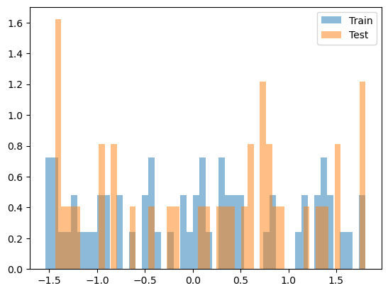

hybridpredictmaize22
================

<!-- WARNING: THIS FILE WAS AUTOGENERATED! DO NOT EDIT! -->

Repo for analysis of GEM prediction for maize yield

## Install

``` sh
pip install hybridpredictmaize22
```

## How to use

A demo of the library specifically for this dataset

Generate random data that is the same form as the actual dataset

``` python
import random
#generate random SNP matrix
gene_dosages = [0, .5, 1]
years = [2018,2019]
snp_length = 100
number_hybrids = 20


number_environments = 10
env_col = []
for i,y in zip(np.arange(number_environments),[random.choice(years) for _ in range(number_environments)]):
    env_col.append(f'{i}_{y}')

snp_matrix = (np.arange(number_hybrids),np.array([[random.choice(gene_dosages) for x in range(snp_length)] for _ in range(number_hybrids)]))

#generate random yield data
random_yields = [random.uniform(-1,1) for _ in range(100)]
random_hybrids = [random.choice(range(number_hybrids)) for _ in range(100)]
random_environments = [random.choice((env_col)) for _ in range(100)]
```

``` python
yield_data = pd.DataFrame({"Hybrid":random_hybrids, "Yield_Mg_ha":random_yields, 'Env':random_environments})
yield_data.head()
```

<div>
<style scoped>
    .dataframe tbody tr th:only-of-type {
        vertical-align: middle;
    }

    .dataframe tbody tr th {
        vertical-align: top;
    }

    .dataframe thead th {
        text-align: right;
    }
</style>
<table border="1" class="dataframe">
  <thead>
    <tr style="text-align: right;">
      <th></th>
      <th>Hybrid</th>
      <th>Yield_Mg_ha</th>
      <th>Env</th>
    </tr>
  </thead>
  <tbody>
    <tr>
      <th>0</th>
      <td>0</td>
      <td>0.172954</td>
      <td>0_2018</td>
    </tr>
    <tr>
      <th>1</th>
      <td>9</td>
      <td>0.700284</td>
      <td>4_2018</td>
    </tr>
    <tr>
      <th>2</th>
      <td>7</td>
      <td>-0.799937</td>
      <td>8_2019</td>
    </tr>
    <tr>
      <th>3</th>
      <td>12</td>
      <td>-0.892540</td>
      <td>5_2019</td>
    </tr>
    <tr>
      <th>4</th>
      <td>12</td>
      <td>0.681444</td>
      <td>5_2019</td>
    </tr>
  </tbody>
</table>
</div>

``` python
Weather_Table = np.random.random((50,number_environments))
weather_table = {}
for c,i in enumerate(Weather_Table):
    weather_table[c] = i
    
weather_data = pd.DataFrame(weather_table)
weather_data.insert(0,'Env',env_col)
weather_data.insert(1,'Year',[x.split('_')[1] for x in env_col])

weather_data
```

<div>
<style scoped>
    .dataframe tbody tr th:only-of-type {
        vertical-align: middle;
    }

    .dataframe tbody tr th {
        vertical-align: top;
    }

    .dataframe thead th {
        text-align: right;
    }
</style>
<table border="1" class="dataframe">
  <thead>
    <tr style="text-align: right;">
      <th></th>
      <th>Env</th>
      <th>Year</th>
      <th>0</th>
      <th>1</th>
      <th>2</th>
      <th>3</th>
      <th>4</th>
      <th>5</th>
      <th>6</th>
      <th>7</th>
      <th>...</th>
      <th>40</th>
      <th>41</th>
      <th>42</th>
      <th>43</th>
      <th>44</th>
      <th>45</th>
      <th>46</th>
      <th>47</th>
      <th>48</th>
      <th>49</th>
    </tr>
  </thead>
  <tbody>
    <tr>
      <th>0</th>
      <td>0_2018</td>
      <td>2018</td>
      <td>0.339318</td>
      <td>0.645351</td>
      <td>0.596769</td>
      <td>0.674014</td>
      <td>0.839884</td>
      <td>0.806496</td>
      <td>0.999808</td>
      <td>0.736149</td>
      <td>...</td>
      <td>0.056324</td>
      <td>0.348315</td>
      <td>0.885774</td>
      <td>0.213902</td>
      <td>0.956378</td>
      <td>0.620997</td>
      <td>0.085156</td>
      <td>0.375406</td>
      <td>0.372505</td>
      <td>0.259006</td>
    </tr>
    <tr>
      <th>1</th>
      <td>1_2018</td>
      <td>2018</td>
      <td>0.572323</td>
      <td>0.125541</td>
      <td>0.686176</td>
      <td>0.277879</td>
      <td>0.768659</td>
      <td>0.013587</td>
      <td>0.925902</td>
      <td>0.559293</td>
      <td>...</td>
      <td>0.715583</td>
      <td>0.181945</td>
      <td>0.528709</td>
      <td>0.144964</td>
      <td>0.367816</td>
      <td>0.740463</td>
      <td>0.270510</td>
      <td>0.310422</td>
      <td>0.131063</td>
      <td>0.194258</td>
    </tr>
    <tr>
      <th>2</th>
      <td>2_2019</td>
      <td>2019</td>
      <td>0.889345</td>
      <td>0.452250</td>
      <td>0.763568</td>
      <td>0.818604</td>
      <td>0.096647</td>
      <td>0.317412</td>
      <td>0.069779</td>
      <td>0.357168</td>
      <td>...</td>
      <td>0.412320</td>
      <td>0.129185</td>
      <td>0.766032</td>
      <td>0.863806</td>
      <td>0.620753</td>
      <td>0.285642</td>
      <td>0.554314</td>
      <td>0.204787</td>
      <td>0.453862</td>
      <td>0.888054</td>
    </tr>
    <tr>
      <th>3</th>
      <td>3_2019</td>
      <td>2019</td>
      <td>0.492631</td>
      <td>0.262753</td>
      <td>0.527975</td>
      <td>0.654456</td>
      <td>0.220014</td>
      <td>0.900263</td>
      <td>0.287942</td>
      <td>0.989492</td>
      <td>...</td>
      <td>0.241567</td>
      <td>0.654816</td>
      <td>0.778694</td>
      <td>0.857906</td>
      <td>0.896364</td>
      <td>0.703187</td>
      <td>0.115679</td>
      <td>0.495839</td>
      <td>0.191042</td>
      <td>0.603319</td>
    </tr>
    <tr>
      <th>4</th>
      <td>4_2018</td>
      <td>2018</td>
      <td>0.368332</td>
      <td>0.300210</td>
      <td>0.363662</td>
      <td>0.289667</td>
      <td>0.735534</td>
      <td>0.974251</td>
      <td>0.734114</td>
      <td>0.137067</td>
      <td>...</td>
      <td>0.454452</td>
      <td>0.261224</td>
      <td>0.455968</td>
      <td>0.658335</td>
      <td>0.119698</td>
      <td>0.204962</td>
      <td>0.244722</td>
      <td>0.851620</td>
      <td>0.391992</td>
      <td>0.923202</td>
    </tr>
    <tr>
      <th>5</th>
      <td>5_2019</td>
      <td>2019</td>
      <td>0.534571</td>
      <td>0.192684</td>
      <td>0.409649</td>
      <td>0.898634</td>
      <td>0.045608</td>
      <td>0.642902</td>
      <td>0.495185</td>
      <td>0.812611</td>
      <td>...</td>
      <td>0.116396</td>
      <td>0.101575</td>
      <td>0.863596</td>
      <td>0.099896</td>
      <td>0.472187</td>
      <td>0.909758</td>
      <td>0.373246</td>
      <td>0.021258</td>
      <td>0.141784</td>
      <td>0.794518</td>
    </tr>
    <tr>
      <th>6</th>
      <td>6_2018</td>
      <td>2018</td>
      <td>0.569923</td>
      <td>0.474057</td>
      <td>0.312642</td>
      <td>0.612845</td>
      <td>0.510297</td>
      <td>0.534694</td>
      <td>0.422548</td>
      <td>0.476793</td>
      <td>...</td>
      <td>0.943216</td>
      <td>0.358081</td>
      <td>0.961395</td>
      <td>0.100413</td>
      <td>0.233050</td>
      <td>0.008584</td>
      <td>0.646845</td>
      <td>0.763853</td>
      <td>0.356459</td>
      <td>0.764686</td>
    </tr>
    <tr>
      <th>7</th>
      <td>7_2018</td>
      <td>2018</td>
      <td>0.207798</td>
      <td>0.710351</td>
      <td>0.510869</td>
      <td>0.239727</td>
      <td>0.271019</td>
      <td>0.207443</td>
      <td>0.325767</td>
      <td>0.021929</td>
      <td>...</td>
      <td>0.122032</td>
      <td>0.259493</td>
      <td>0.498929</td>
      <td>0.049220</td>
      <td>0.621886</td>
      <td>0.040410</td>
      <td>0.475822</td>
      <td>0.130571</td>
      <td>0.306685</td>
      <td>0.410237</td>
    </tr>
    <tr>
      <th>8</th>
      <td>8_2019</td>
      <td>2019</td>
      <td>0.915032</td>
      <td>0.620752</td>
      <td>0.103160</td>
      <td>0.211781</td>
      <td>0.904108</td>
      <td>0.688374</td>
      <td>0.175970</td>
      <td>0.508636</td>
      <td>...</td>
      <td>0.864712</td>
      <td>0.410570</td>
      <td>0.792315</td>
      <td>0.869885</td>
      <td>0.598791</td>
      <td>0.822897</td>
      <td>0.901996</td>
      <td>0.085463</td>
      <td>0.678950</td>
      <td>0.675902</td>
    </tr>
    <tr>
      <th>9</th>
      <td>9_2018</td>
      <td>2018</td>
      <td>0.732095</td>
      <td>0.241041</td>
      <td>0.366285</td>
      <td>0.400097</td>
      <td>0.641570</td>
      <td>0.473785</td>
      <td>0.028948</td>
      <td>0.676443</td>
      <td>...</td>
      <td>0.280371</td>
      <td>0.080082</td>
      <td>0.348361</td>
      <td>0.458913</td>
      <td>0.965020</td>
      <td>0.715099</td>
      <td>0.170961</td>
      <td>0.975335</td>
      <td>0.836953</td>
      <td>0.707490</td>
    </tr>
  </tbody>
</table>
<p>10 rows × 52 columns</p>
</div>

``` python
yield_data
```

<div>
<style scoped>
    .dataframe tbody tr th:only-of-type {
        vertical-align: middle;
    }

    .dataframe tbody tr th {
        vertical-align: top;
    }

    .dataframe thead th {
        text-align: right;
    }
</style>
<table border="1" class="dataframe">
  <thead>
    <tr style="text-align: right;">
      <th></th>
      <th>Hybrid</th>
      <th>Yield_Mg_ha</th>
      <th>Env</th>
    </tr>
  </thead>
  <tbody>
    <tr>
      <th>0</th>
      <td>0</td>
      <td>0.172954</td>
      <td>0_2018</td>
    </tr>
    <tr>
      <th>1</th>
      <td>9</td>
      <td>0.700284</td>
      <td>4_2018</td>
    </tr>
    <tr>
      <th>2</th>
      <td>7</td>
      <td>-0.799937</td>
      <td>8_2019</td>
    </tr>
    <tr>
      <th>3</th>
      <td>12</td>
      <td>-0.892540</td>
      <td>5_2019</td>
    </tr>
    <tr>
      <th>4</th>
      <td>12</td>
      <td>0.681444</td>
      <td>5_2019</td>
    </tr>
    <tr>
      <th>...</th>
      <td>...</td>
      <td>...</td>
      <td>...</td>
    </tr>
    <tr>
      <th>95</th>
      <td>14</td>
      <td>0.403292</td>
      <td>6_2018</td>
    </tr>
    <tr>
      <th>96</th>
      <td>15</td>
      <td>-0.584356</td>
      <td>9_2018</td>
    </tr>
    <tr>
      <th>97</th>
      <td>5</td>
      <td>-0.442337</td>
      <td>0_2018</td>
    </tr>
    <tr>
      <th>98</th>
      <td>5</td>
      <td>0.582230</td>
      <td>1_2018</td>
    </tr>
    <tr>
      <th>99</th>
      <td>11</td>
      <td>0.747516</td>
      <td>0_2018</td>
    </tr>
  </tbody>
</table>
<p>100 rows × 3 columns</p>
</div>

``` python
#Create a GEM dataset
test_split = 2019
gem = GEM(test_split)
gem.Y = YT(yield_data, test_split)
gem.W = WT(weather_data, test_split)
gem.SNP = snp_matrix
```

``` python
#example of how to unscale a value
gem.Y.scaler.inverse_transform(np.array(1.4).reshape(-1,1))
```

    array([[0.72497222]])

``` python
gem.Y.plot_yields()
```



``` python
ds = GemDataset(gem.W.Tr, gem.Y.Tr, gem.SNP)
next(iter(ds))
```

    (0.4306352768532538,
     array([0. , 1. , 0. , 0. , 0. , 0. , 0. , 1. , 0.5, 1. , 0. , 0. , 0. ,
            0. , 1. , 1. , 1. , 0. , 1. , 0.5]),
     array([[-0.71524192,  1.07874277,  0.91088512,  1.5270517 ,  1.11322279,
              0.93109807,  1.23907291,  1.13221733, -0.16217186, -0.94644327,
             -1.29547698,  1.18767089, -0.28106303, -1.62111753, -1.25439181,
              0.74721689, -0.40219838, -0.94991248,  0.11836801,  1.45003639,
              0.2085608 ,  1.26145177, -0.22833088,  1.33564082, -0.66387703,
             -1.69727085,  1.23139475, -1.58403587, -0.14933558, -0.17806999,
              0.37216138, -0.1451076 ,  1.00816768,  0.69339373, -0.52115649,
              1.33239693,  1.09584004,  1.92880839, -0.03361344, -0.13238862,
             -1.17509009,  1.04532305,  1.19806318, -0.26282049,  1.24236785,
              0.74561763, -1.21357394, -0.61928798, -0.12512069, -1.04847961]]))
