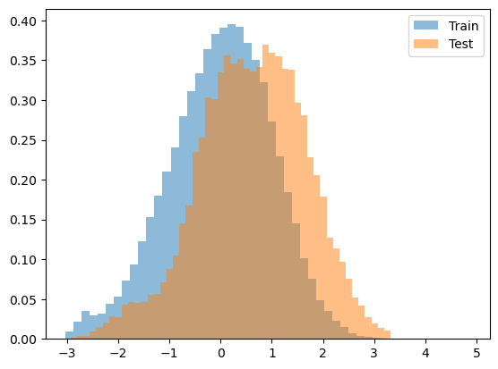

hybridpredictmaize22
================

<!-- WARNING: THIS FILE WAS AUTOGENERATED! DO NOT EDIT! -->

Repo for analysis of GEM prediction for maize yield

## Install

``` sh
pip install hybridpredictmaize22
```

## How to use

A demo of the library specifically for this dataset

Generate random data that is the same form as the actual dataset

``` python
import random
#generate random SNP matrix
gene_dosages = [0, .5, 1]
years = [2018,2019]
snp_length = 100
number_hybrids = 20


number_environments = 10
env_col = []
for i,y in zip(np.arange(number_environments),[random.choice(years) for _ in range(number_environments)]):
    env_col.append(f'{i}_{y}')

snp_matrix = (np.arange(number_hybrids),np.array([[random.choice(gene_dosages) for x in range(snp_length)] for _ in range(number_hybrids)]))

#generate random yield data
random_yields = [random.uniform(-1,1) for _ in range(100)]
random_hybrids = [random.choice(range(number_hybrids)) for _ in range(100)]
random_environments = [random.choice((env_col)) for _ in range(100)]
```

``` python
yield_data = pd.DataFrame({"Hybrid":random_hybrids, "Twt_kg_m3":random_yields, 'Env':random_environments})
yield_data.head()
```

<div>
<style scoped>
    .dataframe tbody tr th:only-of-type {
        vertical-align: middle;
    }

    .dataframe tbody tr th {
        vertical-align: top;
    }

    .dataframe thead th {
        text-align: right;
    }
</style>
<table border="1" class="dataframe">
  <thead>
    <tr style="text-align: right;">
      <th></th>
      <th>Hybrid</th>
      <th>Twt_kg_m3</th>
      <th>Env</th>
    </tr>
  </thead>
  <tbody>
    <tr>
      <th>0</th>
      <td>15</td>
      <td>0.122736</td>
      <td>7_2018</td>
    </tr>
    <tr>
      <th>1</th>
      <td>19</td>
      <td>-0.982788</td>
      <td>8_2018</td>
    </tr>
    <tr>
      <th>2</th>
      <td>16</td>
      <td>-0.715674</td>
      <td>4_2019</td>
    </tr>
    <tr>
      <th>3</th>
      <td>1</td>
      <td>-0.604091</td>
      <td>2_2019</td>
    </tr>
    <tr>
      <th>4</th>
      <td>4</td>
      <td>0.138607</td>
      <td>7_2018</td>
    </tr>
  </tbody>
</table>
</div>

``` python
Weather_Table = np.random.random((50,number_environments))
weather_table = {}
for c,i in enumerate(Weather_Table):
    weather_table[c] = i
    
weather_data = pd.DataFrame(weather_table)
weather_data.insert(0,'Env',env_col)
weather_data.insert(1,'Year',[x.split('_')[1] for x in env_col])

weather_data
```

<div>
<style scoped>
    .dataframe tbody tr th:only-of-type {
        vertical-align: middle;
    }

    .dataframe tbody tr th {
        vertical-align: top;
    }

    .dataframe thead th {
        text-align: right;
    }
</style>
<table border="1" class="dataframe">
  <thead>
    <tr style="text-align: right;">
      <th></th>
      <th>Env</th>
      <th>Year</th>
      <th>0</th>
      <th>1</th>
      <th>2</th>
      <th>3</th>
      <th>4</th>
      <th>5</th>
      <th>6</th>
      <th>7</th>
      <th>...</th>
      <th>40</th>
      <th>41</th>
      <th>42</th>
      <th>43</th>
      <th>44</th>
      <th>45</th>
      <th>46</th>
      <th>47</th>
      <th>48</th>
      <th>49</th>
    </tr>
  </thead>
  <tbody>
    <tr>
      <th>0</th>
      <td>0_2018</td>
      <td>2018</td>
      <td>0.000254</td>
      <td>0.319551</td>
      <td>0.035621</td>
      <td>0.227980</td>
      <td>0.341458</td>
      <td>0.546306</td>
      <td>0.992078</td>
      <td>0.527062</td>
      <td>...</td>
      <td>0.267738</td>
      <td>0.596514</td>
      <td>0.948693</td>
      <td>0.767477</td>
      <td>0.784856</td>
      <td>0.121439</td>
      <td>0.053526</td>
      <td>0.972353</td>
      <td>0.667356</td>
      <td>0.210994</td>
    </tr>
    <tr>
      <th>1</th>
      <td>1_2019</td>
      <td>2019</td>
      <td>0.692550</td>
      <td>0.167253</td>
      <td>0.891801</td>
      <td>0.174253</td>
      <td>0.466269</td>
      <td>0.819173</td>
      <td>0.543367</td>
      <td>0.116657</td>
      <td>...</td>
      <td>0.441986</td>
      <td>0.123692</td>
      <td>0.831439</td>
      <td>0.161838</td>
      <td>0.932493</td>
      <td>0.240424</td>
      <td>0.389518</td>
      <td>0.758521</td>
      <td>0.820345</td>
      <td>0.818243</td>
    </tr>
    <tr>
      <th>2</th>
      <td>2_2019</td>
      <td>2019</td>
      <td>0.310805</td>
      <td>0.834717</td>
      <td>0.174031</td>
      <td>0.880392</td>
      <td>0.304212</td>
      <td>0.506488</td>
      <td>0.719241</td>
      <td>0.154603</td>
      <td>...</td>
      <td>0.323938</td>
      <td>0.086857</td>
      <td>0.561431</td>
      <td>0.251565</td>
      <td>0.984370</td>
      <td>0.421870</td>
      <td>0.581498</td>
      <td>0.474244</td>
      <td>0.981454</td>
      <td>0.242238</td>
    </tr>
    <tr>
      <th>3</th>
      <td>3_2018</td>
      <td>2018</td>
      <td>0.168983</td>
      <td>0.146432</td>
      <td>0.297660</td>
      <td>0.404348</td>
      <td>0.223658</td>
      <td>0.995731</td>
      <td>0.138922</td>
      <td>0.520578</td>
      <td>...</td>
      <td>0.031069</td>
      <td>0.861631</td>
      <td>0.732336</td>
      <td>0.925542</td>
      <td>0.883066</td>
      <td>0.972881</td>
      <td>0.971857</td>
      <td>0.554228</td>
      <td>0.460823</td>
      <td>0.003826</td>
    </tr>
    <tr>
      <th>4</th>
      <td>4_2019</td>
      <td>2019</td>
      <td>0.889311</td>
      <td>0.760565</td>
      <td>0.627111</td>
      <td>0.917845</td>
      <td>0.114576</td>
      <td>0.790566</td>
      <td>0.717116</td>
      <td>0.168854</td>
      <td>...</td>
      <td>0.678892</td>
      <td>0.392014</td>
      <td>0.963459</td>
      <td>0.935532</td>
      <td>0.951570</td>
      <td>0.240657</td>
      <td>0.034179</td>
      <td>0.424162</td>
      <td>0.973886</td>
      <td>0.850691</td>
    </tr>
    <tr>
      <th>5</th>
      <td>5_2019</td>
      <td>2019</td>
      <td>0.840537</td>
      <td>0.551299</td>
      <td>0.358102</td>
      <td>0.831560</td>
      <td>0.918915</td>
      <td>0.831252</td>
      <td>0.282564</td>
      <td>0.799184</td>
      <td>...</td>
      <td>0.873633</td>
      <td>0.345485</td>
      <td>0.516328</td>
      <td>0.484452</td>
      <td>0.256458</td>
      <td>0.620188</td>
      <td>0.865280</td>
      <td>0.692949</td>
      <td>0.399166</td>
      <td>0.453688</td>
    </tr>
    <tr>
      <th>6</th>
      <td>6_2018</td>
      <td>2018</td>
      <td>0.130870</td>
      <td>0.280761</td>
      <td>0.060550</td>
      <td>0.423239</td>
      <td>0.516184</td>
      <td>0.161224</td>
      <td>0.952239</td>
      <td>0.106798</td>
      <td>...</td>
      <td>0.017802</td>
      <td>0.778329</td>
      <td>0.895007</td>
      <td>0.774554</td>
      <td>0.656000</td>
      <td>0.849980</td>
      <td>0.178146</td>
      <td>0.850434</td>
      <td>0.623957</td>
      <td>0.107135</td>
    </tr>
    <tr>
      <th>7</th>
      <td>7_2018</td>
      <td>2018</td>
      <td>0.719483</td>
      <td>0.803670</td>
      <td>0.998227</td>
      <td>0.071568</td>
      <td>0.255642</td>
      <td>0.181241</td>
      <td>0.956694</td>
      <td>0.854110</td>
      <td>...</td>
      <td>0.731441</td>
      <td>0.592800</td>
      <td>0.550758</td>
      <td>0.567894</td>
      <td>0.925801</td>
      <td>0.395589</td>
      <td>0.648109</td>
      <td>0.882344</td>
      <td>0.332641</td>
      <td>0.266824</td>
    </tr>
    <tr>
      <th>8</th>
      <td>8_2018</td>
      <td>2018</td>
      <td>0.350904</td>
      <td>0.227883</td>
      <td>0.309317</td>
      <td>0.764543</td>
      <td>0.828184</td>
      <td>0.913891</td>
      <td>0.429822</td>
      <td>0.517680</td>
      <td>...</td>
      <td>0.795310</td>
      <td>0.226579</td>
      <td>0.366331</td>
      <td>0.128104</td>
      <td>0.140170</td>
      <td>0.222874</td>
      <td>0.019438</td>
      <td>0.342723</td>
      <td>0.883683</td>
      <td>0.538669</td>
    </tr>
    <tr>
      <th>9</th>
      <td>9_2019</td>
      <td>2019</td>
      <td>0.952286</td>
      <td>0.751521</td>
      <td>0.038771</td>
      <td>0.811740</td>
      <td>0.759131</td>
      <td>0.064776</td>
      <td>0.559202</td>
      <td>0.947265</td>
      <td>...</td>
      <td>0.504153</td>
      <td>0.232528</td>
      <td>0.635701</td>
      <td>0.409427</td>
      <td>0.300384</td>
      <td>0.374953</td>
      <td>0.812686</td>
      <td>0.871986</td>
      <td>0.007444</td>
      <td>0.309995</td>
    </tr>
  </tbody>
</table>
<p>10 rows × 52 columns</p>
</div>

``` python
#Create a GEM dataset
test_split = 2019
gem = GEM(test_split)
gem.Y = YT(yield_data, test_split)
gem.W = WT(weather_data, test_split)
gem.SNP = snp_matrix
```

``` python
#example of how to unscale a value
gem.Y.scaler.inverse_transform(np.array(1.4).reshape(-1,1))
```

    array([[0.77834143]])

``` python
gem.Y.plot_yields()
```



``` python
ds = GemDataset(gem.W.Tr, gem.Y.Tr, gem.SNP)
next(iter(ds))
```

    (0.26482250083989317,
     array([0.5, 0. , 1. , 0.5, 1. , 1. , 0. , 0. , 0. , 1. , 1. , 1. , 0. ,
            0.5, 0. , 1. , 0.5, 0.5, 0. , 0. ]),
     array([[ 1.78634147,  1.9360867 ,  1.88877202, -1.3236466 , -0.79848959,
             -1.07663098,  0.75693198,  1.47072531, -0.64210535,  0.70222238,
             -0.25650619,  1.47441563, -1.53368866, -1.3861355 ,  1.21150587,
              0.78644392,  1.94941579,  1.0448482 ,  1.47620847, -0.25594202,
             -1.0173347 ,  1.53229239, -0.89926025,  0.61172586,  1.2217525 ,
             -1.55385798,  1.37288448, -0.72504126, -0.89490659,  1.53101721,
             -0.99542111, -0.6372661 , -1.23360731, -0.87627214,  0.76527065,
              0.8175526 , -0.49720711,  1.30480752, -1.26397969,  1.07416109,
              1.08311574, -0.08400376, -0.68275791, -0.23424647,  0.87116714,
             -0.3445116 ,  0.73235506,  0.68812829, -1.39046323,  0.22882867]]))
